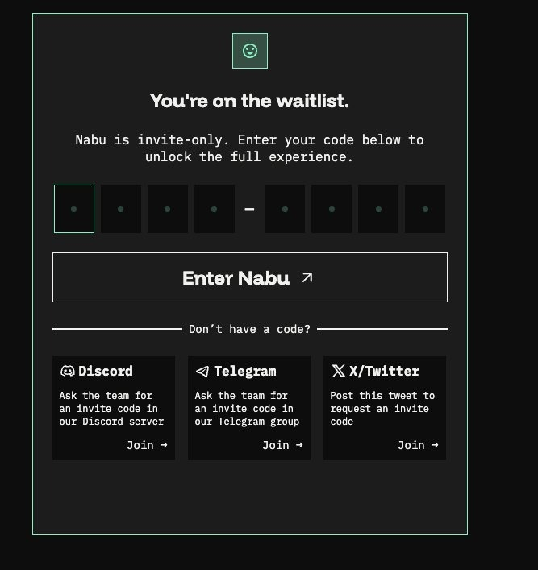

# How to use Nabu: a step-by-step guide

## Start

1. Go to [app.nabu.pro](https://app.nabu.pro) and click \[Log In] in the top-right corner.

2. After logging in, the You're on the waitlist screen appears. Enter your 8-character invite code in the format XXXX-XXXX and click \[Enter Nabu].

\
Settings MEXC
-------------

3. Connect your exchange. To run any strategy that uses a centralized exchange, you need to link a CEX account to Nabu.&#x20;
4. Log in to your [MEXC account](https://www.mexc.com/user) and go to mexc.com/user. From the left sidebar, click API Management.

.png)

5. On the Manage API / Create New API Key page, set permissions exactly as follows:

.png")

6. Once you created your keys in your API page  you have to set your trading pairs by clicking \[set]

.png)

Important: If you lose the Secret Key, you cannot retrieve it from MEXC. You will need to delete the API key on MEXC and generate a new one from scratch.

## Settings Nabu

7. Back in Nabu, click Settings in the left sidebar. Under Exchange Connect, select MEXC from the Exchange dropdown and click \[Connect Exchange].

.png)

8. Fund your trading wallet. To run any on-chain (DEX) strategy, you need to fund your Trading Wallet,  a Privy-powered embedded wallet provisioned for you on Ethereum. The Trading Wallet is your trading balance for DEX execution; whatever sits in it is what your DEX strategies can trade with.

**Assets are visible in the settings.**

.png)

9. Add funds. In Settings, scroll to the Trading Wallet section. The Deposit card shows your Wallet Address (with a copy icon), an Amount field, and a Coin dropdown.

.png)

10. Click \[Deposit]. A Privy popup Add funds to your Nabu wallet opens with two options:

.png)

**Important: When using "Receive funds", make sure to select the right chain. Funds sent on the wrong chain will not arrive in your Privvy wallet and may be lost.**

11. To pull funds out, use the Withdraw card next to Deposit. Paste a Recipient Address, enter an Amount, pick a Coin, and click \[Withdraw]. You'll be prompted to sign the transaction with your Privy wallet.

## Run your strategy

12. &#x20;Run your first strategy. Once your exchange is linked and your Trading Wallet is funded, you're ready to deploy a strategy. Describe your trading strategy in natural language.&#x20;

.png)

13. A Draft badge confirms the strategy isn't live yet. When you're happy with it, click \[Deploy strategy] (top-right of the card) to launch it.

.png)

